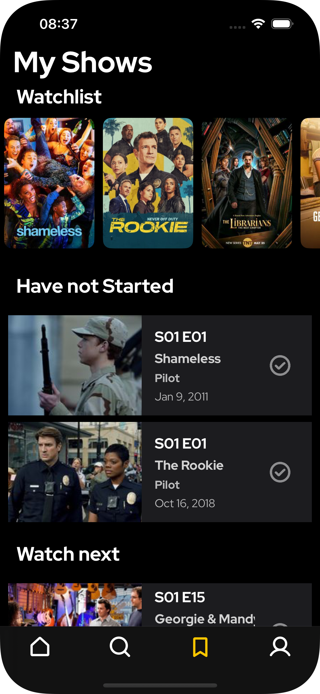

# Tallyvision

> A mobile application to help TV enthusiasts track their favorite TV shows, monitor progress, and receive updates.


## Table of Contents

- [About](#about)
- [Features](#features)
- [Architecture](#architecture)
- [Database Schema](#database-schema)
- [Technology Stack](#technology-stack)
- [Installation](#installation)
- [Usage](#usage)
- [Future Enhancements](#future-enhancements)
- [Contributing](#contributing)
- [License](#license)

## About

TallyVision is designed for users who want an organized way to search, track, and manage their TV show viewing habits. The app provides detailed show information, progress tracking, and a clean user interface.

## Features

- **Search Shows**: Search TV shows via the TVMaze API, view details like title, synopsis, genre, and premiere date.
- **Watchlist Management**: Add or remove shows from your watchlist.
- **Progress Tracking**: Mark episodes as watched and see your progress visually.
- **Show & Cast Info**: Access comprehensive show details, including cast members.

## Screenshots

### Show Details


### Watchlist View


### Episode Tracking


## Architecture

TallyVision follows a layered MVC design:

- **Repositories**: Handle local CRUD operations.
- **Services**: Manage external API interactions (e.g., TVMaze API client).
- **Controllers**: Coordinate data flow between repositories and services.
- **Views**: UIKit components for user interaction.

## Database Schema

- **Show**: Stores TV show metadata (title, premiere date, status, etc.).
- **Episode**: Contains episode details linked to a show (title, air date, duration, season).
- **ShowTracker**: Tracks user progress for each show.

## Technology Stack

- **Database**: SQLite via GRDB.swift
- **Networking**: URLSession with async/await
- **Concurrency**: Swift TaskGroup for parallel data fetching
- **UI**: UIKit

## Installation

1. Clone the repository:
   ```bash
   git clone https://github.com/your-username/tallyvision.git
   ```
2. Open the Xcode project:
   ```bash
   cd tallyvision
   open TallyVision.xcworksapce
   ```
3. Build and run on a simulator or device.

## Usage

1. Launch the app.
2. Use the search bar to find TV shows.
3. Tap a show to view details and add it to your watchlist.
4. Navigate to your watchlist to track and mark episodes as watched.

## Future Enhancements

- Add detailed episode descriptions, runtime, and crew information.
- Display guest cast for individual episodes.
- Allow marking shows as abandoned.
- Implement robust caching and improved data syncing.
- Expand API client capabilities.

---

*Note: This project currently has no formal license. If you plan to reuse or distribute the code, please contact the author or open an issue for clarification.*
